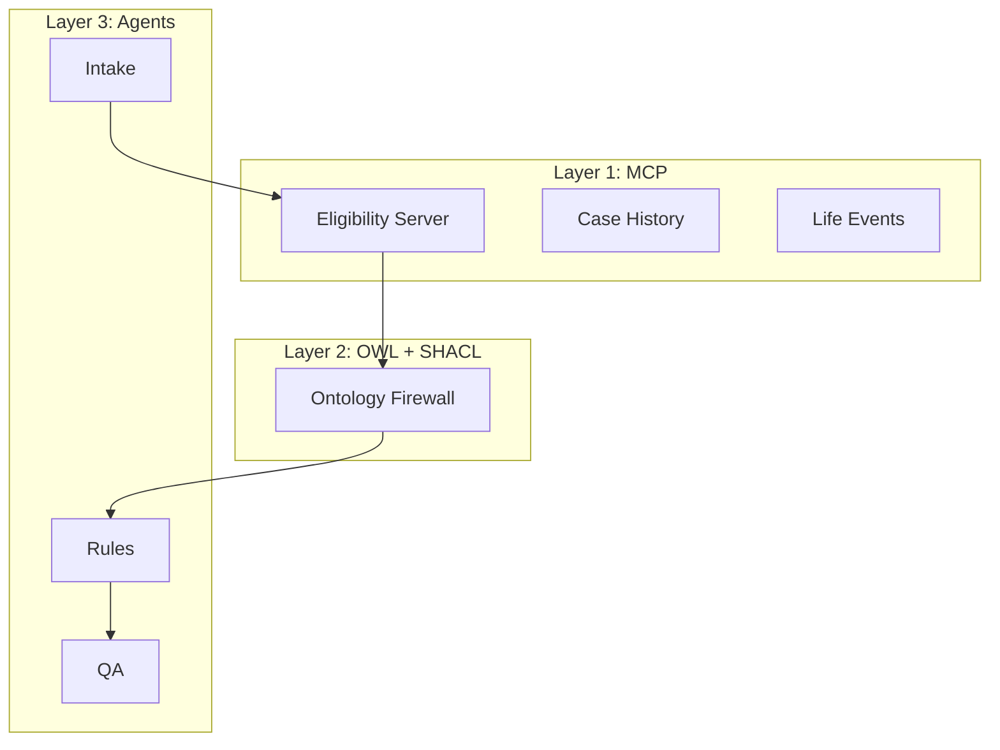

# 🏛️ Human Services AI Architecture

### EU AI Act-Compliant | Citizen-Centric | Production-Ready

> Every government AI system that evaluates eligibility for public benefits
> becomes "High-Risk" under the EU AI Act on **August 2, 2026**.
>
> This is the reference architecture that makes you compliant AND
> improves citizen outcomes at the same time.

**$140 billion in US government benefits go unclaimed every year.
This architecture fixes that — while satisfying EU AI Act Articles 9–15.**

## Why This Exists

Governments face a dual challenge: (1) the EU AI Act classifies benefit-eligibility AI as High-Risk, with strict obligations effective August 2026, and (2) citizens struggle to navigate fragmented programs, leaving billions in benefits unclaimed. This project demonstrates that **compliance is the mechanism for better service delivery** — the same architecture that satisfies Articles 9–15 also enables the "No Wrong Door" pattern and deterministic, explainable eligibility determination.

## EU AI Act Compliance Mapping

| Obligation      | Article | Architecture Component     | Status        |
|-----------------|---------|---------------------------|---------------|
| Risk Management | Art. 9  | SHACL Ontology Firewall   | ✅ Implemented |
| Data Governance | Art. 10 | OWL Semantic Layer       | ✅ Implemented |
| Documentation   | Art. 11 | Versioned ontology + registry | ✅ Implemented |
| Record-Keeping  | Art. 12 | Immutable audit trail     | ✅ Implemented |
| Transparency    | Art. 13 | Multi-level explanations  | ✅ Implemented |
| Human Oversight | Art. 14 | Neuro-symbolic separation | ✅ Implemented |
| Accuracy        | Art. 15 | Deterministic rules engine| ✅ Implemented |

## Quick Start

```bash
pip install -e ".[dev]"
python examples/quickstart.py
```

## The Architecture

Three layers with EU AI Act article annotations:

1. **MCP** — Universal adapter for government systems (Art. 12, 15)
2. **OWL + SHACL** — Shared semantic meaning + deterministic business rules (Art. 9, 10, 11)
3. **Agentic Orchestration** — Neuro-symbolic separation (Art. 13, 14)



## Key Features

- 🇪🇺 **EU AI Act Compliant** — Every component maps to Articles 9-15
- 🏛️ **Government Domain** — SNAP, Medicaid, TANF, Housing with real FPL data
- 🔒 **Deterministic** — Same input → same output, every time
- 🚪 **"No Wrong Door"** — One life event triggers cross-program review
- 🧠 **Neuro-Symbolic** — LLM reasoning + deterministic rules + ontology firewall
- 📋 **Audit-Ready** — Immutable trail satisfying Art. 12 record-keeping
- 💬 **Citizen-Readable** — Three-level explanations (caseworker/citizen/auditor)
- 🌍 **Globally Applicable** — Maps to Colorado AI Act, Texas, California, Canada AIDA

## Examples

- `examples/quickstart.py` — 5-minute getting started
- `examples/benefits_eligibility.py` — Check SNAP/Medicaid eligibility
- `examples/life_event_processing.py` — Process life event across programs
- `examples/ontology_firewall_demo.py` — SHACL blocking invalid actions
- `examples/no_wrong_door.py` — Full "No Wrong Door" pattern
- `examples/compliance_report.py` — Generate EU AI Act conformity report
- `examples/audit_trail_demo.py` — Show deterministic audit trail
- `examples/citizen_explanation_demo.py` — Multi-level explanations

## Running Tests

```bash
make test                    # All tests (99)
make test-unit               # Unit tests only
make test-integration        # Integration tests
make test-compliance         # EU AI Act compliance tests only
make test-scenarios          # Interactive scenario demos
make demo                    # Full colored terminal demo
make compliance-report       # Generate conformity assessment
```

## Documentation

- [Architecture Deep-Dive](docs/ARCHITECTURE.md)
- [EU AI Act Compliance Mapping](docs/EU_AI_ACT_COMPLIANCE.md)
- [Global Regulatory Map](docs/GLOBAL_REGULATORY_MAP.md)
- [No Wrong Door Pattern](docs/NO_WRONG_DOOR.md)
- [90-Day Implementation Plan](docs/90_DAY_IMPLEMENTATION.md)

## Related Articles

- [Every Government AI System Becomes High-Risk on August 2, 2026](https://towardsdatascience.com) — The TDS article
- [Enterprise AI Ontology Roadmap — 30+ Articles](https://medium.com/@cloudpankaj/the-enterprise-ai-ontology-roadmap-30-articles-4-learning-tracks-and-where-to-start-22efc17bb026)
- [The Ontology Firewall: Why Enterprise AI Agents Are Failing](https://medium.com/towards-artificial-intelligence/the-ontology-firewall-why-enterprise-ai-agents-are-failing-in-production-and-the-architecture-7d4a13bbfaaf)

## Related Repositories

- [ontoguard-ai](https://github.com/cloudbadal007/ontoguard-ai) — Generic ontology firewall
- [ontology-firewall-enterprise-iq](https://github.com/cloudbadal007/ontology-firewall-enterprise-iq) — Enterprise IQ implementation
- [universal-agent-connector](https://github.com/cloudbadal007/universal-agent-connector) — MCP + Ontology infrastructure

## Author

**Pankaj Kumar** — Enterprise AI Architect | EU AI Act Compliance | Government Modernization

- Medium: [@cloudpankaj](https://medium.com/@cloudpankaj)
- GitHub: [cloudbadal007](https://github.com/cloudbadal007)
- LinkedIn: [pankaj-kumar](https://www.linkedin.com/in/pankaj-kumar-551b52a/)
- X: [@CloudyPankaj](https://x.com/CloudyPankaj)
- Substack: [badalaiworld](https://badalaiworld.substack.com/)
- YouTube: [@TheCivicStack](https://www.youtube.com/@TheCivicStack)
